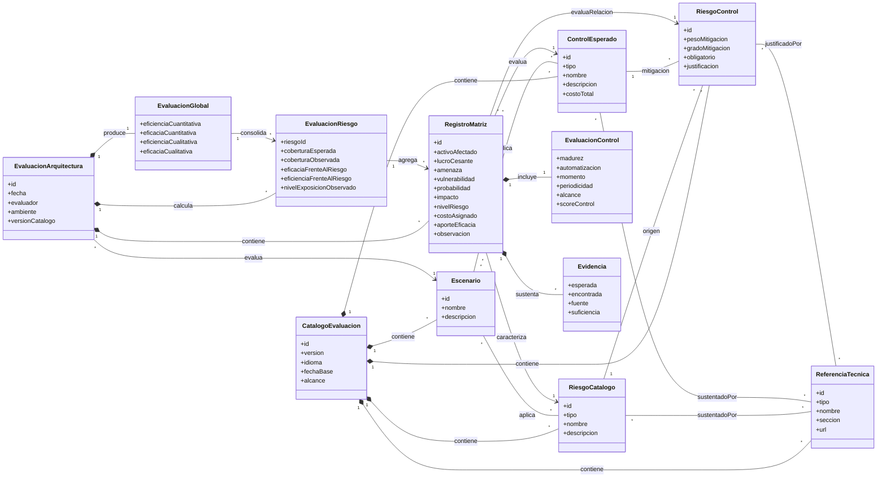

# Modelo de dominio del catálogo OAuth 2.0/OIDC

```mermaid
classDiagram
    direction LR

    class CatalogoEvaluacion {
      +id
      +version
      +idioma
      +fechaBase
      +alcance
    }

    class Escenario {
      +id
      +nombre
      +descripcion
    }

    class RiesgoCatalogo {
      +id
      +tipo
      +nombre
      +descripcion
    }

    class ControlEsperado {
      +id
      +tipo
      +nombre
      +descripcion
      +costoTotal
    }

    class RiesgoControl {
      +id
      +pesoMitigacion
      +gradoMitigacion
      +obligatorio
      +justificacion
    }

    class ReferenciaTecnica {
      +id
      +tipo
      +nombre
      +seccion
      +url
    }

    class EvaluacionArquitectura {
      +id
      +fecha
      +evaluador
      +ambiente
      +versionCatalogo
    }

    class RegistroMatriz {
      +id
      +activoAfectado
      +lucroCesante
      +amenaza
      +vulnerabilidad
      +probabilidad
      +impacto
      +nivelRiesgo
      +costoAsignado
      +aporteEficacia
      +observacion
    }

    class EvaluacionControl {
      +madurez
      +automatizacion
      +momento
      +periodicidad
      +alcance
      +scoreControl
    }

    class Evidencia {
      +esperada
      +encontrada
      +fuente
      +suficiencia
    }

    class EvaluacionRiesgo {
      +riesgoId
      +coberturaEsperada
      +coberturaObservada
      +eficaciaFrenteAlRiesgo
      +eficienciaFrenteAlRiesgo
      +nivelExposicionObservado
    }

    class EvaluacionGlobal {
      +eficienciaCuantitativa
      +eficaciaCuantitativa
      +eficienciaCualitativa
      +eficaciaCualitativa
    }

    CatalogoEvaluacion "1" *-- "*" Escenario : contiene
    CatalogoEvaluacion "1" *-- "*" RiesgoCatalogo : contiene
    CatalogoEvaluacion "1" *-- "*" ControlEsperado : contiene
    CatalogoEvaluacion "1" *-- "*" RiesgoControl : contiene
    CatalogoEvaluacion "1" *-- "*" ReferenciaTecnica : contiene

    Escenario "*" -- "*" RiesgoCatalogo : aplica
    Escenario "*" -- "*" ControlEsperado : aplica

    RiesgoCatalogo "1" -- "*" RiesgoControl : origen
    ControlEsperado "1" -- "*" RiesgoControl : mitigacion

    RiesgoCatalogo "*" -- "*" ReferenciaTecnica : sustentadoPor
    ControlEsperado "*" -- "*" ReferenciaTecnica : sustentadoPor
    RiesgoControl "*" -- "*" ReferenciaTecnica : justificadoPor

    EvaluacionArquitectura "*" --> "1" Escenario : evalua
    EvaluacionArquitectura "1" *-- "*" RegistroMatriz : contiene
    EvaluacionArquitectura "1" *-- "*" EvaluacionRiesgo : calcula
    EvaluacionArquitectura "1" *-- "1" EvaluacionGlobal : produce

    RegistroMatriz "*" --> "1" RiesgoControl : evaluaRelacion
    RegistroMatriz "*" --> "1" RiesgoCatalogo : caracteriza
    RegistroMatriz "*" --> "1" ControlEsperado : evalua
    RegistroMatriz "1" *-- "1" EvaluacionControl : incluye
    RegistroMatriz "1" *-- "*" Evidencia : sustenta

    EvaluacionRiesgo "1" --> "*" RegistroMatriz : agrega
    EvaluacionGlobal "1" --> "*" EvaluacionRiesgo : consolida
```
